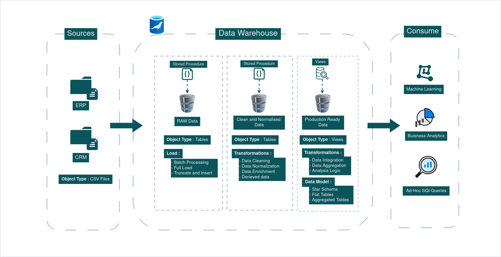

# 🏛️ Medallion Architecture Overview

The Medallion Architecture is a layered approach to organizing data in a modern data warehouse. It provides a scalable, maintainable, and structured method for managing data pipelines by breaking the data journey into three logical layers: Bronze, Silver, and Gold.

### 🥉 Bronze Layer – Raw Data Ingestion

- This layer contains raw, unprocessed data ingested directly from the source systems (ERP and CRM).

- Data is stored as-is, without transformations or filters, to preserve original source fidelity.

- Typical operations include data ingestion from flat files (CSV) and Initial storage in staging tables

### 🥈 Silver Layer – Cleaned & Integrated Data

- This layer holds cleaned, validated, and semi-modeled data.

- Data from various sources is transformed, standardized, and joined.

- Business logic, such as data type casting, filtering nulls, and resolving duplicates, is applied.

- The Silver Layer makes the data query-ready while maintaining a close relationship to the source.

### 🥇 Gold Layer – Business-Level Aggregations

- This is the analytics-ready layer designed for reporting, dashboards, and BI tools.

- Data is fully modeled using facts and dimensions, aligned with business requirements.

- Contains aggregated, filtered, and highly curated data, enabling fast analytical queries.

## 🔄 Benefits of the Medallion Architecture

- Modularity: Each layer can be developed, maintained, and scaled independently.

- Data Lineage: Easy to trace how raw data transforms into analytics-ready assets.

- Data Quality: Each transition layer offers a checkpoint for quality and validation.

- Performance: By separating raw and transformed data, queries on the Gold layer remain fast and optimized.

## 🧱 Implementation in This Project

- Bronze, Silver, and Gold layers are implemented as separate databases in MariaDB due to lack of schema support.

- ETL logic is broken into layered SQL scripts to handle ingestion, cleaning, and transformation in a modular fashion.

- Data flows from flat CSV files → Bronze → Silver → Gold, ensuring a clear, traceable pipeline.

