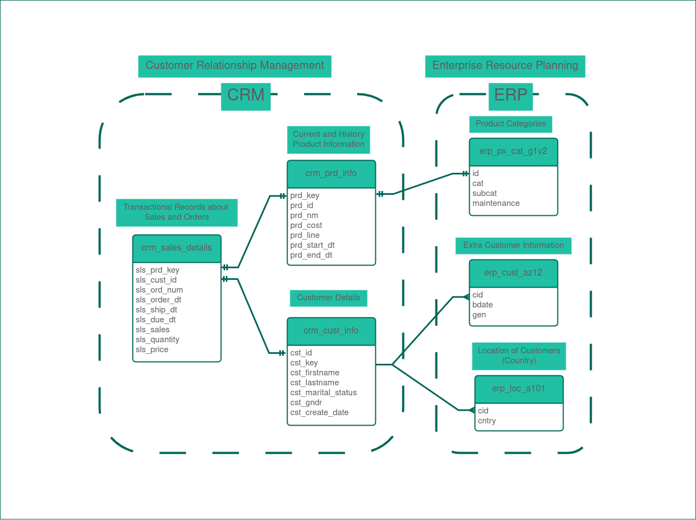
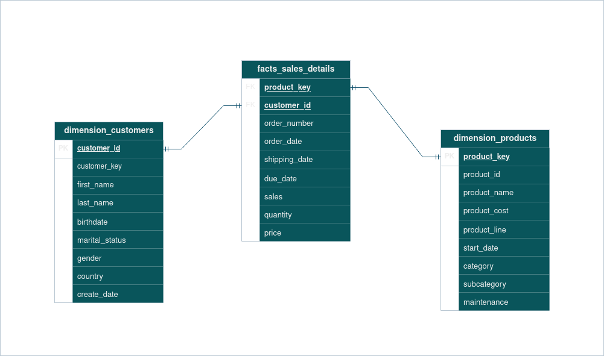

## 📊 Data Warehouse Structure

This project follows the **Medallion Architecture** pattern, comprising three layers: **Bronze**, **Silver**, and **Gold**. Below is an overview of the **Silver** and **Gold** layers.

## 🥈 Silver Layer

The **Silver Layer** represents the cleansed and conformed data stage. Raw data from CRM and ERP systems is transformed into structured relational tables for further modeling in the Gold Layer.

### Key Tables

- `crm_cust_info`: Customer data from CRM sources including identifiers, names, marital status, and gender.
- `crm_prd_info`: Product information from CRM such as product line, cost, and availability dates.
- `crm_sales_details`: Transactional sales data with details like order number, customer and product references, and pricing.
- `erp_cust_az12`: Demographic data (e.g., birthdate and gender) for customers from ERP systems.
- `erp_loc_a101`: Country-level location data for customers.
- `erp_px_cat_g1v2`: Product classification and maintenance flags from ERP data.

## 🥇 Gold Layer

The **Gold Layer** represents the final business-level data model, optimized for reporting and analytics. It organizes data into **dimension tables** and **fact tables** to support business intelligence use cases.  
This layer follows a **Star Schema** design, where fact tables reference multiple dimension tables via surrogate keys, enabling efficient OLAP-style querying.

### Views

- `dimension_customers`
  - **Purpose**: Stores customer details enriched with demographic and geographic attributes.
  - Includes surrogate keys, names, marital status, gender, birthdate, and country of residence.

- `dimension_products`
  - **Purpose**: Contains product details and categorization metadata.
  - Includes identifiers, names, categories, cost, product lines, and maintenance status.

- `facts_sales_details`
  - **Purpose**: Records transactional sales data.
  - Includes sales orders, related customer and product keys, order/shipping dates, quantities, prices, and total sales amount.

